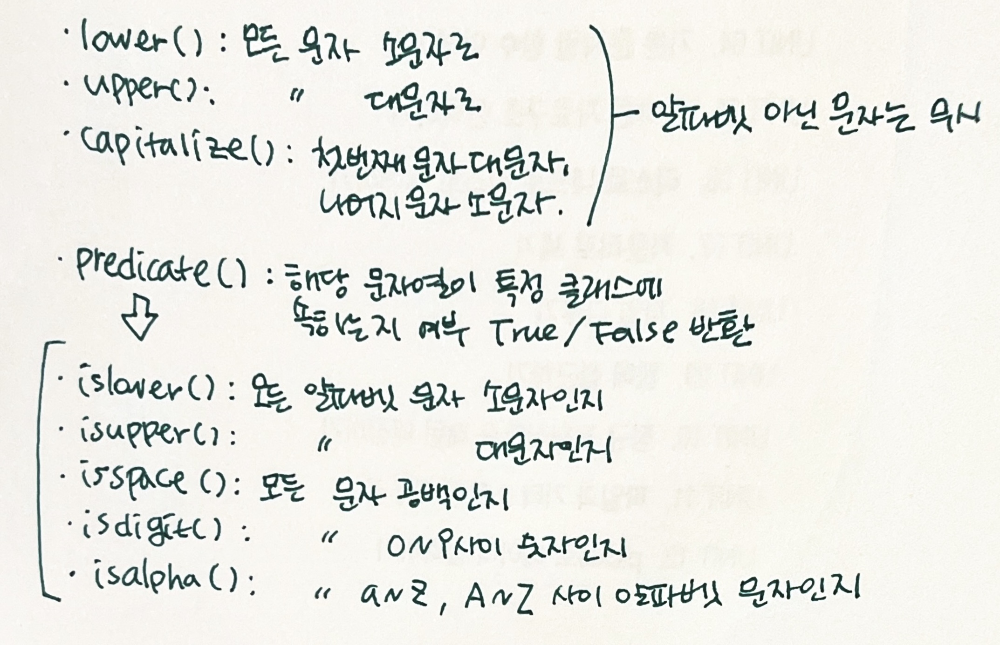
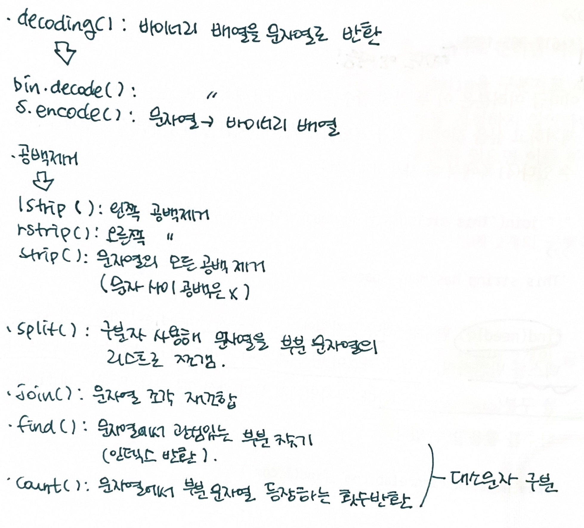

01.데이터 분석 과정
===
- 기술통계(descriptive)  
-가장 당연한 형태  
-시각화한 형태로 표현  

- 추정(inferential)  
-주어진 샘플 크기 작고, 더 큰 모수 알고 싶을 때  

- 인과분석(casual)  
-서로에 영향 미치는 변수 식별  

- 역학분석(mechanistic)  
-변수가 다른 변수에 정확히 어떤 영향?  
  
- 데이터 정제 -> 기술통계 분석, 탐색적 분석 -> 미래 예측  
=> 산포도, 히스토그램, 통계적 요약  
 
  
02.데이터수집 파이프라인
===
- 데이터 수집  
-아티팩트(artifact) 획득  
-데이터 추출  
-데이터 반환  
  
- 자연어로 된 비정형 플레인 텍스트 데이터  
- 정형 데이터  
-쉼표로 구분된 텍스트(CSV) 형식의 데이블형 데이터  
-데이터베이스에 저장된 테이블형 데이터  
-하이퍼텍스트 마크업 언어나 다목적 마크업 언어로 된 태그 데이터  
-JSON 형식의 태그 데이터  
 
  
03.보고서 구조
===
- 보고서 구조  
-요약  
-서론  
-데이터 수집과 처리에 사용한 방법  
-분석 결과  
-결론  
-부록  
 
  
04.기본 문자열 함수 이해
===
  
 
  
 
