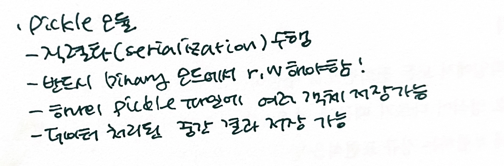

05.올바른 자료구조 선택
===
- List  
-검색시간 선형적 증가  
-> 대용량 데이터 저장 무리  

- Tuple  
-변형 불가  
-검색시간 선형적 증가  

- Set  
-순서 X, 중복 X  
-아이템 인덱스 X  
-검색시간 O(log(N))  

- Dictionary  
-Key를 Value에 mapping  
-같은 dict에 들어있어도 서로 다른 데이터타입 가능  
-검색시간 O(log(N))  
-키-값 검색시 유용  
  
- Dict 만드는 방법  
1) enumerate() -> 아이템 순번이 key로 저장됨  
2) zip()  
  
- List generator로 사용  
-enumerate(seq)  
-zip(kseq, vseq)  
-range()  
-> 이터레이터(for문, 리스트 내포) 제공  
 

06.리스트 내포로 리스트 이해
===
- Collection Type -> List  

- 중첩된 리스트 내포  
함수를 각 리스트 아이템에서 중복 사용 원하지 않으면!  
-리스트 내포를 소괄호로 묶으면 리스트 제너레이터 객체로 인식  
 

07.카운터로 세기  
===
- Counter  
-딕셔너리 스타일의 컬렉션  
-다른 컬렉션 안의 아이템 개수 셀 때 사용  
 

08.파일 다루기  
===
- with문  
-파일 명시적으로 열지만 구문 종료되면 파일 자동으로 닫음  
-> 필요없는 파일 추적 안해도 됨  
  
- read() : 개행문자 포함  
- write() : 개행문자 미포함  
=> 기록한 문자열의 마지막에 개행문자를 추가하지 않음(필요시 직접 입력)  
 

09.웹 접근
===
  
 

10.정규 표현식으로 패턴 매칭
===

 

11.파일과 기타 스트링 다루기
===

 

12.pickle로 데이터 압축
===

 

13.HTML 파일 처리
===
- HTML  
-정형 문서  
-정보를 사람이 읽을 수 있는 형태로 웹에서 표현하려고 사용하는 마크업 언어  
-텍스트와 태그로 구성(태그는 속성 가질 수 있음)  
-XML의 전신  
 but, XML =! HTML  
-HTML 태그는 대소문자 구분 X  
  
- Beautiful soup 모듈  
-HTML, XML 문서 파싱, 읽기, 변형  
-태그 간 상하, 수평적 접근  
-파이썬 딕셔너리 인터페이스로 HTML 태그 속성에 접근 가능  
  
- prettity()  
-마크업 문서를 읽기 쉬운 형태로 출력  
  
- get_text()  
-마크업 문서에서 모든 태그 제거하고 텍스트 부분만 반환  
 

14.CSV 파일 다루기  
===
- CSV  
-정형 텍스트 파일 포맷 : 테이블형에 가까운 데이터  
-열과 행으로 구성  
-구분자 : 보통 쉼표  
 

 

15.JSON 파일 읽기
===
- JSON  
-간단한 데이터 교환 포맷  

- 지원 데이터타입  
-기본 데이터 타입  
-배열  
-객체  
-배열이나 객체, 기본 데이터 타입으로 구성된 어떤 재귀적 조합  
-**집합, 복소수 같은 데이터 타입과 구조는 저장 불가**  
  
- JSON 직렬화 수행  
-복잡한 데이터를 JSON 파일에 저장하는 것  
-dump(), dumps()  
-loads() : JSON 문자열을 파이썬 객체로 변환  
 

16.자연어 처리
===
- 파이썬 자연어 처리 모듈  
-nltk(natual language toolkit)  

- NLTK 코퍼스(corpus)  
-정형이나 비정형적인 단어나 표현의 묶음  
  
- 의미론적 유사도 계산  
-path_similarity()  
-유사도: 0~1 실수  
 유사도 0: 두 단어 서로 연관 X  
 유사도 1: 완전 유의어  

- 정규화(normalization)  
-추가적으로 데이터 처리하기 위해 자연어로 된 텍스트 준비하는 과정  
1. 토큰화  
2. 단어 대소문자 통일  
3. 불용어 제거  
4. 형태소 분석  
5. 원형 추출  

- 다른 텍스트 처리 방식  
-세그먼테이션  
-텍스트 분류  
-대상 추출  
-잠재적 의미 색인  
   
