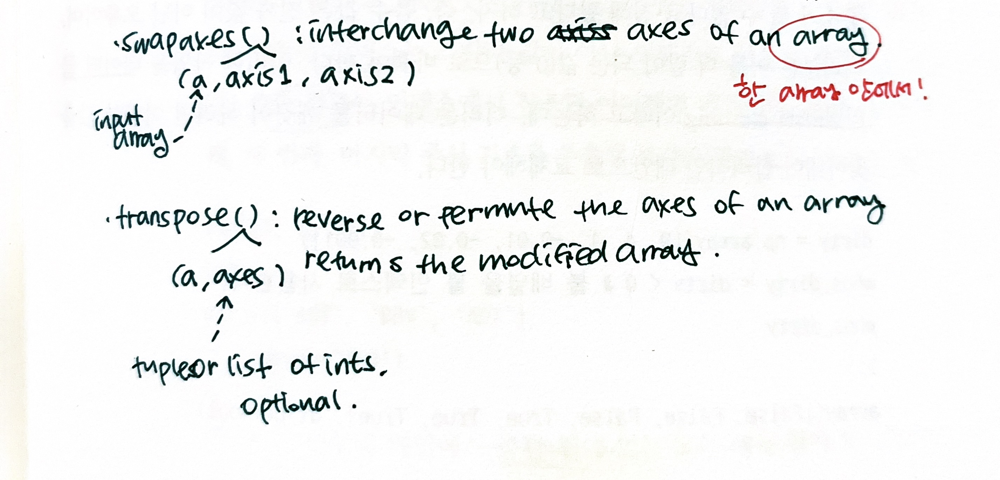

17.MySQL 데이터베이스 설정  
===
- 관계형 데이터베이스  
-영구적으로 저장되고 정렬되어 있으며, 인덱스 처리된 테이블의 묶음  
-하나의 테이블: 하나의 변수 타입  
 테이블의 열: 변수  
 테이블의 행: 레코드/관찰값  

- MySQL 명령어  
-대소문자 구분 X  
-마지막에 세미콜론  

- 데이터베이스 스키마  
-데이터베이스의 구조로 모든 테이블, 열 데이터 타입, 인덱스, 제약 조건, 테이블 간 관계 표현  

- 기본키    
-항상 인덱스 가능  
-고유한 레코드 식별 가능  
-검색 속도 높임  
-언제나 Not Null  

- 마지막 수정 시점의 타임스탬프  
-수정 현황 알 수 있게 함  
  
- Not Null  
-대상 열이 Null이 아니도록 강제  

- 인덱스  
-검색시간 획기적으로 단축  
 but, 데이터 입력·삭제 시간 ↑  
-하나의 열에 있는 값들이 모두 고유하면 해당 열에는 UNIQUE 제약조건 붙이기  
-열 데이터 폭 가변적이면 고유길이 지정  
 
  
18.MySQL 사용: 명령줄  
===
- 다섯가지 기본 데이터베이스 연산 제공
-입력, 삭제, 변형, 추출, 결합)  

- inner 결합  
-두 테이블 모두에서 하나 이상의 공통 결합이 있는 행 반환  

- left/right 결합
-반대편 테이블에 매칭되는 행이 하나도 없어도 left/right의 모든 행 결합  

- outer 결합  
-두 테이블 중 한 테이블에만 행이 있어도 이를 반환  

- natural 결합  
-outer 결합과 비슷하지만 이름 같은 열 중복 반환 X  
 

19.MySQL 사용: pymysql  
===
- pymysql
-데이터베이스 서버에 연결한 후, 데이터베이스 쿼리로 파이썬 함수 변환하고, 파이썬 데이터 구조로 데이터베이스 조회 결과 반환  

- connect()  

- execute()  
-실행할 쿼리 전달  
-처리된 행 개수 반환  
 
- fetchall()
-해당하는 모든 레코드 가져오기  
-튜플로 된 열의 리스트로 변환할 수 있는 제너레이터 반환  
 

20.문서 다루기: MongoDB  
===
- MongoDB  
-비관계형 데이터베이스  
-서로 연결되지 않은 다양한 DB 지원  
-하나의 DB는 하나 이상의 문서 컬렉션으로 구성  
-하나의 컬렉션에 있는 모든 문서에는 고유한 구분자 들어있음  

- insert_one(doc), insert_many(docs)
-1개의 문서나 문서 리스트를 컬렉션에 입력  
-InsertOneResult나 InsertManyResult 객체 반환  
  
- find_one(), find()
-특정한 조건에 부합하는 하나 이상의 문서 갖는데 사용  
-find_one(): 문서 반환  
-find(): 커서 제너레이터 반환  
-딕셔너리를 파라미터로 전달하면 파라미터로 전달된 키 값과 일치하는 값 지닌 문서 반환  

- sort()  
- count()  
- delete_one(doc), delete_many(docs)  
 

21.배열 만들기  
===
- 배열  
-타입 같은 아이템만 가짐  
  
- Numpy 배열  
-대상 데이터의 "View"  
-대상 데이터의 객체 변경하면 배열 데이터도 변경됨  
-> :copy=True" 해서 복제해두면 좋음  
 

22.행열 전환과 형태 변형  
===
- reshape()
-대상 배열의 모양 바꿈  
-파라미터로 배열의 새 차원 정의 가능 -> 기존 배열과 새로운 배열의 아이템 개수는 항상 동일해야함  
-속성 T: 해당 배열의 전치된 값  

- swapaxes()  
-파라미터로 전달하는 2개의 축을 서로 바꿔 다차원 배열 전치  

- transpose()  
-튜플로 전달된 파라미터에 따라 다차원 배열의 일부 혹은 전체 축 치환  
 

  

 

23.인덱싱과 자르기
===
- 관계형 연산자와 불 연산자  
-관계형 연산자(<, == 등)는 Numpy 배열에 불 연산을 수행하는 &, |, !인 비트 단위 연산자보다 처리 순위 떨어짐  
-일반적인 파이썬 불 연산자인 or, and, not은 관계형 연산자보다 처리 순위 떨어지기에 헷갈릴 수 있음  
-> 배열 비교에 괄호 씌워 Numpy가 이를 먼저 처리하게 하기  
 

24.브로드캐스팅  
===
차원만 같다면 numpy 배열은 다른 배열과 벡터화된 사칙 연산 가능  
- 브로드캐스팅
-배열에서 벡터 연산  
-2차원 브로드캐스팅은 두 배열의 모양 같거나 둘 중 하나가 스칼라 값이면 가능  
 
파이썬 기본 표현식에서 seq * 5는 리스트 seq를 5번 복제
같은 numpy 표현식에서는 seq의 모든 엘리먼트에 각각 5를 곱함  
 
