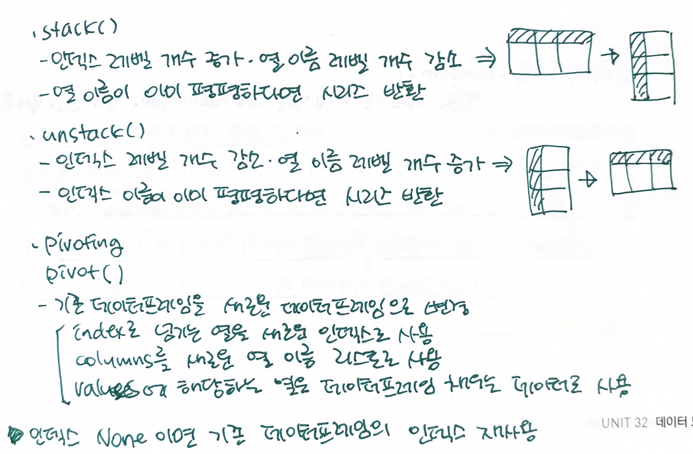

25.유니버셜 함수
===
- ufunc 사용하면 함수 한번 호출해 배열의 모든 아이템에 적용 가능  

- numpy.greater()  
-Return the truth value of (x1>x2)  

- numpy.isnan()  
-결측치 찾을 때!  
 

26.조건부 함수
===
- where(c, a, b)  
-numpy의 삼항연산자(if~else)  

- any(), all()  
-각각 일부 혹은 모든 배열의 엘리먼트가 True라면 True 반환  

- nonzero()  
-0이 아닌 모든 엘리먼트의 인덱스 반환  
 

27.배열 집계, 정렬
===
- cumsum()
-누적합 계산  

- cumprod()  
-누적곱 계산  

- sort()  
-배열을 그 자리에서 정렬(원래 배열값 변경됨)  
-> 원래 배열 유지하고 싶으면 복사본 만들어 두기  
 

28.배열을 셋처럼 다루기  
===
- unique()  
-중복되지 않는 값으로 구성된 새로운 배열 반환  

- in1d(ar1, ar2)  
-ar의 엘리먼트가 ar2에 존재하는지 여부를 bool 배열로 반환  
 but, **in1d 대신 isin() 쓰는 것 추천!(in1d와 똑같이 사용하면 됨)  
  
 
 29.배열 저장, 읽기 
 ===
 - loadtxt()  
 - savetxt()
  
 
 30.합성 사인파 만들기
 ===
 - 합성 사인 곡선  
 -주기적인 신호 의미  
  
 
 31.Pandas 데이터 구조에 익숙해지기
 ===
 - Series  
 -레이블이 붙은/인덱스 처리된 1차원 벡터  
 -시리즈에 속한 모든 엘리먼트는 하나의 데이터타입에 속해야함  
 -정수형 인덱스가 기본값  
 -단일 변수 관측 값 기록에 매우 적합  
 - series 속성값  
   - values: series 안의 모든 값 리스트  
   - index: series의 index  
   - index.values: 모든 index값의 배열  
   => 이 값을 바꾸면 시리즈, 인덱스 값 바뀜  
  
 - index 커스터마이징 방법  
 1) 딕셔너리를 시리즈 생성자로 넘기기  
 2) 새로운 인덱스 생성 후, 기존 시리즈에 붙이기  
  
 - name 속성값  
 -시리즈 값과 인덱스 이름 정의  
 -시리즈와 인덱스 특징 알려주는 기록  
 
 
 - Frame  
 -레이블이 붙은 행과 열로 된 테이블(엑셀 스프레드시트나 MySQL 테이블과는 다름)  
 -frame의 각 열은 series  
 -딕셔너리의 키는 열 이름, 값은 열을 구성하는 값이 됨  
 -데이터프레임 인덱스는 0번째 축(수직), 열은 1번째 축(수평)  
 -브로드캐스팅 지원
   
 - 데이터프레임의 개별 열 접근  
 -딕셔너리/오브젝트 구문 사용  
 
 - 데이터프레임 새로운 열 추가  
 -딕셔너리 구문 사용  
 -> 오브젝트 구문 사용시 새로운 열 대신 해당 데이터프레임에 새 속성 생성  
  

32.데이터 모양 바꾸기  
===
- 데이터 테이블링  
-열과 행을 숫자나 문자로 된 레이블과 연결 짓는 것  

- 데이터 테이블의 인덱스  
-행에 할당된 레이블의 묶음  
-행에 접근할 때 사용하는 도구이자 식별자  

- reset_index()  
- set_index()  
-새로운 데이터프레임 반환  
-> inplace=True : 기존 데이터프레임 수정  

- drop()  
-특정행 삭제된 데이터프레임 복사본 반환  
-> inplace=True 해야 원래 df에서 행 삭제됨  
 

- 재인덱싱(reindex())  
-기존 데이터프레임과 시리즈에서 행이나 열, 행과 열을 추려 새 데이터프레임이나 시리즈 생성  
-선택된 행과 열이 원래 데이터프레임에 있지 않다면 pandas는 nan값으로 채운 새로운 행과 열 생성  
-옵셔널 파라미터에 ffill이나 bfill 전달하면 앞이나 뒤의 값 사용해 결측치 메울 수 있음  
 

- 계층적인덱싱 == 다층 == 멀티  
-MultiIndex.from.tuples()  
-레이블로 된 튜플 묶음과 옵셔널 파라미터인 레벨 리스트 names를 전달받아 멀티인덱스 생성  
-만든 멀티인덱스를 기존 데이터프레임이나 시리즈에 붙이거나 DataFrame() 생성자에 전달 가능  
-인덱스 레벨 중 일부를 선택해 데이터 추출하면 새로운 데이터 프레임 만듦  
-모든 레벨의 레이블 선택하면 시리즈 만듦  
 

- Stacking과 Pivoting  
-데이터프레임 다루기 쉽게 변형!  

  

 

33.데이터 누락 다루기
===
- 결측치 삭제 : dropna()
-결측치 가진 열이나 행의 일부 또는 전체 삭제  
 정제된 df 복사본 반환  

- 결측치 보정  
-isnull(), notnull(): 해당 값이 nan이거나 nan이 아니면 True 반환  
-평균값 보정  
 fillna(): 상수 이용해 전체 프레임의 결측치 보정  
   
 - 값 교체  
 -replace(): 특정 값이나 값 리스트로 교체  
 -combine_first(): 두 데이터프레임이나 두 시리즈 결합  
  
 
