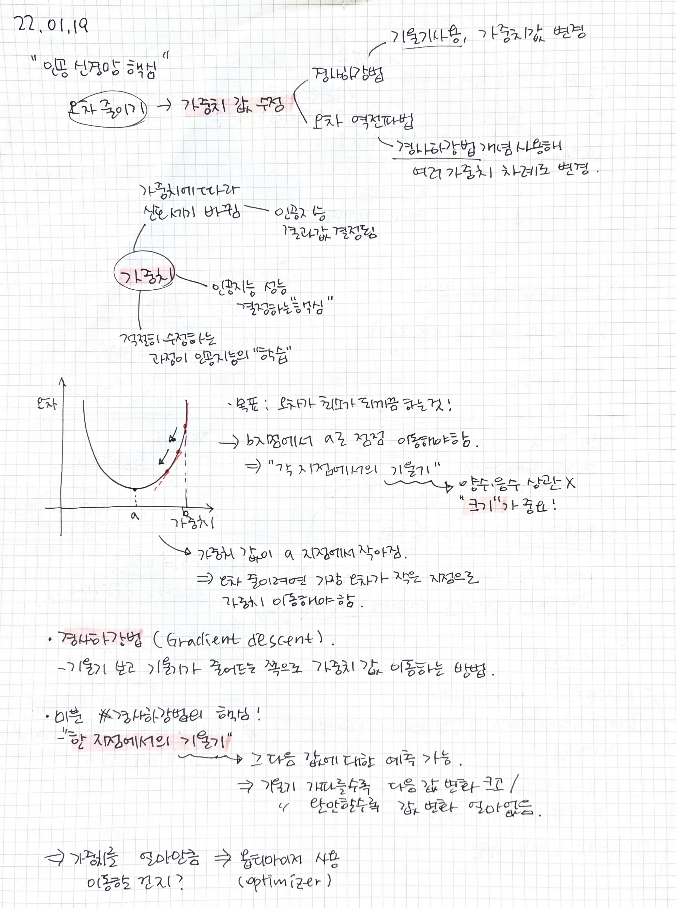

Day 2
===
# 인공신경망 학습원리  
## 인공신경망 오차 구하기  
### 남녀 구분하는 인공지능 모델 오차 구하기  
- 이진분류 문제(Binary crossentroy): 2개 중 하나로 구분하는 문제  
- 예측값 == 결과값 -> 오차 0  
  예측값 != 결과값 -> 오차 발생  
  => 인공지능이 예측한 모든 데이터에 대한 결과값에 대해 오차값 구함  
  
### 나이대 예측하는 인공지능 모델 오차 구하기  
- 다중 분류 손실 함수(Categorical crossentropy)  
  : 여러 값 중 하나 예측하는 모델일 경우 정답 예측할 경우 오차 0  
    정답 아닌 값을 높은 확률로 예측하면 오차 많게  
    정답 아닌 값을 낮은 확률로 예측하면 오차 적게  
  
### 나이 예측하는 인공지능 모델 오차 구하기  
오차값 = (정답값 - 예측값) 차이 모두 구한 값들의 합  
- 평균 제곱 오차(mean squared error)  
  : 예측 값이 실제 값에서 얼마나 떨어져 있는지 알아보는 방법  
  (이때 생기는 오차를 제곱하기 때문에 평균 오차 제곱이라 함)  
 
  
## 오차 줄이기  
### 가중치, 경사 하강법  
  
 
  
### 오차 역전파법(back propagation = chain rule)  
인공신경망 가중치 값은 한두 개가 아님  
-> 뒤에서부터 앞으로 값 수정해가기  
  
[back propagation - Andrew ng](https://youtu.be/mOmkv5SI9hU)  
오차 있으면 마지막부터 처음까지 되돌아가면서 경사 하강법 사용해 각각의 가중치 값 수정해 감  
  
